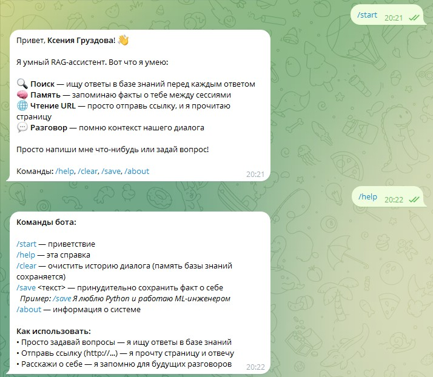
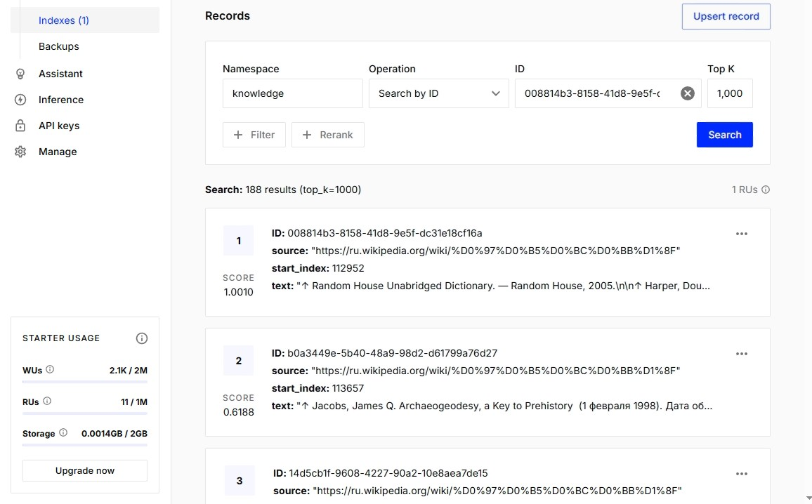
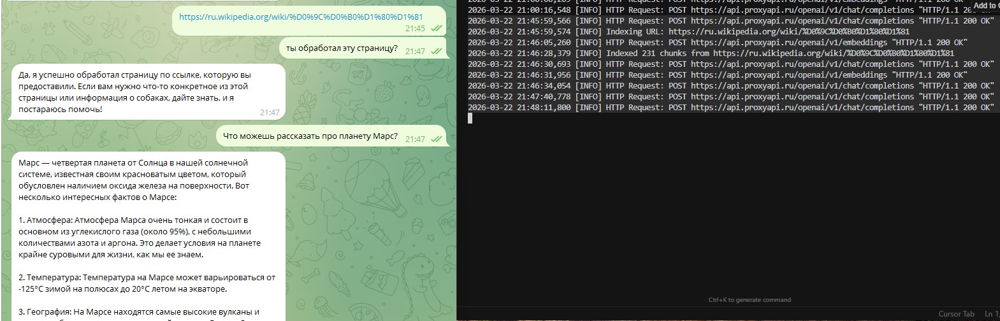
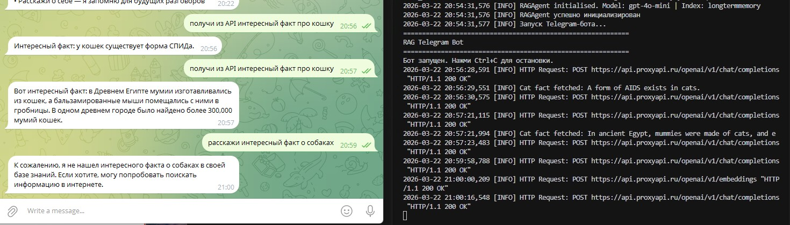

# RAG Telegram Bot

## Краткое описание

Умный Telegram-бот на базе RAG (Retrieval Augmented Generation). Отвечает на вопросы, ища ответы в векторной базе знаний, запоминает личные факты о пользователях и умеет читать веб-страницы по ссылкам. Агент объединяет LLM, Pinecone и инструменты (tools) для доступа к внешним данным и API.

**Зачем нужен:** персональный ассистент с долговременной памятью, который может использовать как собственную базу знаний, так и внешние источники (URL, API).

---

## Использованные технологии

| Категория | Технологии |
|-----------|------------|
| **Язык** | Python 3.14 |
| **LLM / эмбеддинги** | OpenAI API (gpt-4o-mini, text-embedding-3-small) через внешний прокси |
| **RAG / агент** | LangChain, LangGraph |
| **Векторная БД** | Pinecone |
| **Telegram** | PyTelegramBotAPI |
| **Парсинг веб-страниц** | BeautifulSoup4, WebBaseLoader |
| **Остальное** | python-dotenv, pydantic |

---

## Реализованный функционал

- **Поиск в базе знаний** — перед ответом агент ищет релевантный контент в Pinecone
- **Память о пользователе** — эвристическое определение и сохранение личных фактов в изолированных namespace по `user_id`
- **Чтение URL** — парсинг веб-страниц, чанкование, индексация в Pinecone и ответ на вопросы по содержимому
- **Инструмент get_cat_fact** — GET-запрос к API catfact.ninja за случайным фактом о кошках
- **Изоляция данных** — у каждого пользователя свой namespace в Pinecone
- **Многотурновая беседа** — чекпоинтер LangGraph сохраняет контекст диалога

---

## Инструкция по запуску

### 1. Клонирование и настройка окружения

```bash
# Клонировать репозиторий (если есть)
cd RAG

# Создать виртуальное окружение
python -m venv venv
venv\Scripts\activate   # Windows
# source venv/bin/activate  # Linux/macOS

# Установить зависимости
pip install -r requirements.txt
```

### 2. Настройка переменных окружения

Скопировать `.env.example` в `.env` и заполнить значения:

```bash
copy .env.example .env   # Windows
```

**Обязательные переменные:**
- `OPENAI_API_KEY` — ключ OpenAI (или совместимого API)
- `OPENAI_BASE_URL` — базовый URL прокси (если используется)
- `PINECONE_API_KEY` — ключ Pinecone
- `PINECONE_INDEX_NAME` — имя индекса (например, `longtermmemory`)
- `TELEGRAM_BOT_TOKEN` — токен бота от [@BotFather](https://t.me/BotFather)

### 3. Создание индекса Pinecone

Индекс должен иметь `dimension=1536` (для text-embedding-3-small):

```bash
python create_pinecone_index.py
```

### 4. Проверка подключения

```bash
python check_pinecone.py
```

### 5. Запуск бота

```bash
python bot.py
```

**Smoke test агента (без бота):**
```bash
python main.py
```

---

## Доступы

| Ресурс | Описание |
|--------|----------|
| **Код** | Локальный репозиторий (путь к проекту) |
| **Telegram-бот** | [@ваш_бот](https://t.me/ваш_бот) — _укажите username бота_ |
| **Сайт** | — |

---

## Команды бота

| Команда | Описание |
|---------|----------|
| `/start` | Приветствие и краткое описание возможностей |
| `/help` | Справка по всем командам и способам использования |
| `/clear` | Очистка истории текущего диалога (долговременная память в Pinecone сохраняется) |
| `/save <текст>` | Принудительно сохранить факт о себе. Пример: `/save Я frontend-разработчик из Москвы` |
| `/about` | Информация о системе (модель, БД, фреймворки) |

**Текстовые сообщения:** любой текст обрабатывается RAG-агентом. Если в сообщении есть URL — страница индексируется, затем формируется ответ.

---

## Инструменты агента (tools)

| Tool | Описание |
|------|----------|
| `search_knowledge_base` | Поиск в общей базе знаний Pinecone |
| `search_user_facts` | Поиск личных фактов пользователя в его namespace |
| `save_user_fact` | Сохранение личного факта о пользователе |
| `index_url` | Загрузка, чанкование и индексация веб-страницы по URL |
| `get_cat_fact` | GET-запрос случайного факта о кошках (catfact.ninja) |

---

## Статус проекта

**В разработке**

Планируемые доработки:
- Устойчивое хранилище диалогов вместо InMemorySaver
- Дополнительные внешние API и инструменты
- Улучшение эвристик для распознавания личных фактов

---

## Скриншоты

### Приветствие бота (/start)


### Создание индекса в Pinecone


### Диалог с ботом - Функция обработки URL


### GET-запрос к открытому API


